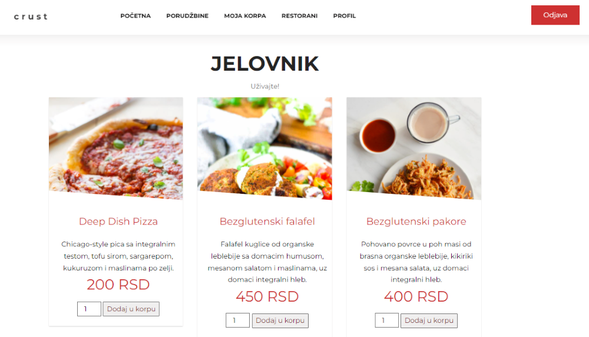

# Crust Food Delivery Service 
Veb aplikacija za sistem koji podržava naručivanje hrane, napravljena za kurs Veb programiranje, FTN, 2020.
Aplikaciju koriste 4 grupe (uloge) korisnika: Kupac, Menadžer, Administrator i Dostavljač.

## Autori: 
• <b>Jelena Radman</b> 
• <b>Božana Ruljić</b>

## Ključne funkcionalnosti
<h3>Administrator</h3>
<ul>
  <li>Registracija menadžera i dostavljača</li>
  <li>Dodavanje novih restorana</li>
  <li>Uklanjanje i banovanje korisnika</li>
  <li>Uvid u aktivnosti sistema</li>
</ul>
<h3>Menadžer</h3>
<ul>
  <li>Izmjene jelovnika</li>
  <li>Upravljanje recenzijama restoranja</li>
  <li>Mijenjanje statusa porudžbina</li>
  <li>Odobravanje dostavljača porudžbina</li>
</ul>
<h3>Dostavljač</h3>
<ul>
  <li>Pregled porudžbina za dostavu</li>
  <li>Apliciranje za dostavljanje neisporučenih porudžbina</li>
  <li>Pregled svojih dostava</li>
</ul>
<h3>Kupac</h3>
<ul>
  <li>Pregled restorana i kreiranje porudžbina</li>
  <li>Praćenje statusa porudžbine</li>
  <li>Otkazivanje još nepripremljenih porudžbina</li>
  <li>Ostavljanje recenzije za restoran</li>
</ul>

## Screenshots

